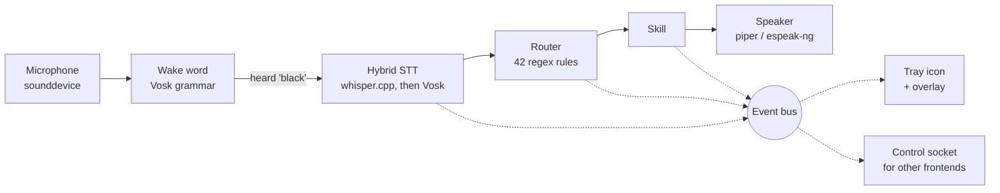
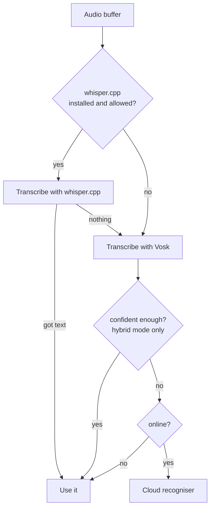

# Architecture

How a spoken sentence becomes an action.



Solid arrows are the data path. Dotted arrows are events — the UI never touches
the audio layer directly, it only subscribes, and neither does anything outside
the process: that is what the control socket is for.

## The layers

| Module | Responsibility |
|---|---|
| `blackvoice/audio/` | Microphone capture, speech recognition, speech output, wake word |
| `blackvoice/nlu/` | Turning a transcript into an `Intent` |
| `blackvoice/skills/` | Doing the thing |
| `blackvoice/core/` | Event bus, logging, the shell safety guard |
| `blackvoice/ui/` | Tray icon, popup overlay, the painted logo |
| `blackvoice/app.py` | The engine — audio loop, state machine, confirmations |

## The audio loop

`Engine._loop()` runs on its own thread:

1. Read a block from the microphone (16 kHz, 16-bit mono, 8000 samples)
2. Feed it to the wake-word detector
3. On a hit — or when the tray icon is clicked — enter a conversation

A conversation is one activation: listen, understand, act, answer.

### Wake word

Vosk accepts a **restricted grammar**, which turns the general recogniser into a
cheap keyword spotter: it only has to decide between the wake phrases and
`[unk]`. That keeps idle CPU low, which matters for something that sits in the
tray all day.

If grammar mode is unavailable, it degrades to fuzzy matching over normal partial
results, at a similarity ratio of 0.78.

### Endpointing

Recording stops on **silence**, not on Vosk's own utterance boundaries:

```
level >= silence_threshold  ->  speech, reset the silence counter
level <  silence_threshold  ->  silence, accumulate
silence >= silence_timeout  ->  stop recording
```

Doing it on the audio level rather than the recogniser means it behaves
identically when only the cloud path exists.

## Hybrid recognition

Three tiers, tried in order, each one only reached when the one before it did
not answer:



**Why use whisper.cpp over Vosk at all?** It is simply a more accurate model.
Vosk is small and fast enough to keep loaded all the time, but whisper.cpp
gets more commands right, at the cost of a subprocess call per utterance
instead of a streaming pass.

**Why is Vosk still here, then?** Two reasons: it is the fallback for a
machine that has not installed whisper.cpp (`speech.engine: "auto"`, the
default, degrades to it silently — see [Configuration → speech](Configuration#speech--recognition)),
and it is what streams, which is why it alone does wake-word detection.

Connectivity, for the cloud tier, is probed with a 1-second TCP connect to
`8.8.8.8:53`, cached for 20 seconds so it is not repeated per utterance.

**How well any of this actually works on your voice** is not something to
guess at: `blackvoice eval record` / `blackvoice eval run` measure it — see
[Configuration → speech](Configuration#speech--recognition).

## Intent routing

A rule is a regex with optional named groups; a named group becomes a slot.

```python
Rule("volume_set", "system", "volume_set", [
    r"\b(?:set\s+)?volume\s*(?:to|at|=)?\s*(?P<value>\d{1,3})\b",
])
```

Rules are tried **in order, first match wins**, so ordering is part of the
design:

- Specific rules come before general ones
- The generic `open X` / `close X` rules are tried **last**, otherwise
  `open downloads` would never reach the folder rule and `run command df -h`
  would be read as an application named *“command df -h”*
- Two rules get a second look in `Router._is_bad_match` — `calculate` needs a
  real operator, and `open`/`close` reject question-shaped phrases

Anything matching nothing becomes `ai.ask`, so an unrecognised sentence is
answered rather than rejected.

## Skills

Every skill implements one method:

```python
class Skill(ABC):
    name: str

    @abstractmethod
    def handle(self, intent: Intent) -> Reply: ...
```

`Reply` carries what to say, what to display, whether it succeeded, and
optionally a confirmation prompt with a callback:

```python
Reply(
    speech="Should I really shut down? Say yes to confirm.",
    confirm="Shut down the computer?",
    on_confirm=lambda: self._really_shut_down(),
)
```

The engine holds that callback as a `PendingConfirmation` for 30 seconds. A
“yes” runs it; a “no”, a “stop”, a different command, or the timeout all drop it.

`SkillRegistry.dispatch` wraps every call in a try/except — a skill that raises
returns an error reply instead of taking down the audio loop.

## Portability

Linux desktops disagree about which tools are installed, so nothing is assumed.
Every action probes a list of candidates and uses the first one present:

| Action | Tried in order |
|---|---|
| Volume | `wpctl` (PipeWire) → `pactl` (PulseAudio) → `amixer` (ALSA) |
| Brightness | `brightnessctl` → `light` → `/sys/class/backlight` |
| Screenshot | `gnome-screenshot` → `spectacle` → `grim` → `scrot` → `import` → `maim` |
| Lock | `loginctl` → `xdg-screensaver` → `gnome-screensaver` → `swaylock` → `i3lock` → `dm-tool` |
| Speech | `piper` → `espeak-ng` → `spd-say` → `pyttsx3` |
| Browser | `xdg-open` → `gio` → `firefox` → `chromium` |

This is why it works on GNOME, KDE, Xfce and tiling window managers without
configuration.

## Threads

| Thread | Runs |
|---|---|
| main | Qt event loop, tray icon, overlay |
| `engine` | Audio loop, recognition, skill dispatch |
| `tts` | Speech output queue |
| `control` | The control socket's own `asyncio` event loop |
| timers | One short-lived thread per timer or reminder |

The UI must only be touched from the Qt thread, so the engine publishes to the
event bus and `BusBridge` re-emits each event as a Qt signal with
`QueuedConnection`. That hop is what makes it safe. The control socket
subscribes to the same bus from its own thread and hops onto its `asyncio`
loop with `call_soon_threadsafe` before writing to any connected client —
the same problem as `BusBridge`, solved the way `asyncio` solves it rather
than the way Qt does.

`Speaker.say()` returns immediately and queues; `stop()` kills the current
utterance mid-word.

## Graceful degradation

Every optional dependency is imported lazily and its absence is handled:

| Missing | Result |
|---|---|
| whisper.cpp binary or model | `speech.engine: "auto"` silently uses Vosk instead |
| `vosk` or its models | No offline fallback tier; `hybrid` mode leans on whisper.cpp or the cloud |
| `PyQt6` | Falls back to headless mode with a message |
| `sounddevice` / PortAudio | Clear error naming the package to install |
| `speech_recognition` | No cloud fallback; offline still works |
| espeak-ng and friends | Replies are printed instead of spoken |
| `psutil` | Battery and system-info commands report why |
| No Unix domain sockets (not Linux) | The control socket is simply not opened |

`blackvoice doctor` reports all of this in one place.

## External frontends

The tray and overlay call straight into `Engine` because they share its
address space — a normal Python function call, no serialisation. Anything
that does not run in this process cannot do that, and needs a channel across
the process boundary instead.

`control_socket.py` is that channel: a Unix domain socket at
`$XDG_RUNTIME_DIR/blackvoice/control.sock`, one JSON object per line each way.
A request carries `id` and `op`; the reply echoes `id` back with either
`{"ok": true, "result": ...}` or `{"ok": false, "error": "..."}`. Frames with
no `id` but an `"event"` key instead are pushed unprompted whenever the
engine's own bus fires — `state`, `heard`, `reply`, `confirm`.

```
{"id": 1, "op": "get_state"}                                     →
{"id": 1, "ok": true, "result": {"state": "idle"}}

{"id": 2, "op": "set_config",
 "params": {"path": "ai.ollama_model", "value": "qwen2.5:1.5b"}}  →
{"id": 2, "ok": true, "result": {"path": "ai.ollama_model",
                                  "value": "qwen2.5:1.5b"}}
```

A handful of operations exist so far — `get_config`, `set_config`,
`get_schema`, `submit_text`, `list_ollama_models`, `pull_ollama_model` —
chosen to prove the architecture and answer one screen's worth of settings,
not as a general remote-control surface. Two decisions are worth knowing
before extending it, both explained at length in the module's own docstring:
a socket file rather than a TCP port, because the filesystem's permissions on
it *are* the access control with no token to manage; and hand-rolled JSON
lines rather than `websockets` or `aiohttp`, because both ship a wheel per
CPython version and everything bundled into `/opt/blackvoice/lib` has to be
`py3-none` or `abi3` — the same constraint that keeps whisper.cpp a
subprocess rather than a Python binding.

`flutter_app/` in the repository is the first thing speaking this protocol —
a settings screen for the Ollama model picker and a plain window for typed
commands. It was written without a Flutter SDK available to build it, so
treat it as an unverified draft of the client side of this protocol, not as a
working app yet; its own README says exactly what has and has not been
checked.

## Source layout

```
blackvoice/
├── app.py             engine: audio loop, state machine, confirmations
├── cli.py             run · text · setup · eval · doctor · devices · say · config
├── config.py          dataclass config + environment overrides
├── control_socket.py  the local control socket for external frontends
├── evaluate.py        the accuracy harness: `blackvoice eval`
├── models.py          Vosk + whisper.cpp model download
├── ollama_models.py   the curated lightweight-model list
├── audio/
│   ├── mic.py        microphone stream, RMS metering
│   ├── stt.py        hybrid recognition: whisper.cpp, then Vosk
│   ├── tts.py        speech output
│   └── wake.py       wake-word detection
├── nlu/
│   ├── intents.py    42 rules, English
│   └── router.py     matching and the AI fallback
├── skills/
│   ├── base.py       Skill, Reply, SkillRegistry
│   ├── system.py     apps, volume, brightness, power, radios
│   ├── files.py      search, folders, disk
│   ├── terminal.py   guarded shell access
│   ├── ai.py         Ollama / Claude / OpenAI
│   ├── utils.py      clock, weather, timers, notes, media, maths
│   └── control.py    help, cancel, sleep, yes/no — a skill, not the socket above
├── ui/
│   ├── tray.py       tray icon, menu, bus bridge
│   ├── overlay.py    popup card and waveform
│   ├── settings.py   the settings window, generated from Config
│   └── icons.py      the logo, painted with QPainter
└── core/
    ├── bus.py        publish/subscribe
    ├── logs.py       console + rotating file
    └── safety.py     shell guard

flutter_app/           an early, unverified Flutter frontend over the control
                        socket — see its own README before assuming it builds
```

## Next

→ **[Security Model](Security-Model)** — the guard in detail
→ **[Writing Skills](Writing-Skills)** — add your own
