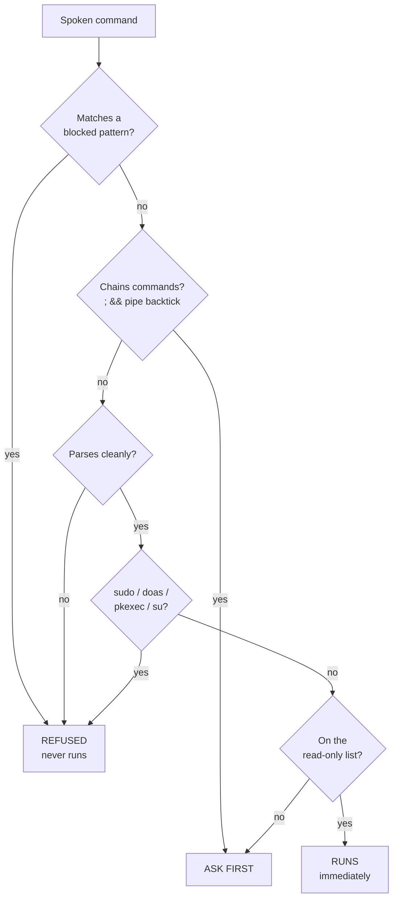

# Security Model

Voice recognition mishears things. That is not an edge case — it is the normal
operating condition. A system that lets a misheard word reach a shell is
dangerous, so shell access here is deliberately narrow.

## Three buckets

Every command that would reach a shell goes through
[`ShellGuard`](https://github.com/RudraLabs-dev/blackvoice/blob/main/blackvoice/core/safety.py)
and lands in exactly one of three buckets.



### Refused outright

These never run, no matter how you phrase it and regardless of any setting:

| Pattern | Catches |
|---|---|
| `rm -rf` and friends | recursive or forced deletion |
| `mkfs` | formatting a filesystem |
| `dd ... of=/dev/` | writing straight to a device |
| `> /dev/sd` | redirecting onto a disk |
| `:(){ :|:& };:` | fork bombs, spaced or not |
| `chmod -R 777 /` | opening up the whole filesystem |
| `shutdown` / `reboot` / `halt` / `poweroff` | handled by the system skill, which asks first |
| `curl … \| sh`, `wget … \| sh` | piping the internet into a shell |
| `mv … /dev/null` | destroying a file by moving it |
| `userdel`, `passwd` | account tampering |

Anything run as **root** is refused separately: `sudo`, `doas`, `pkexec` and `su`
are rejected before the pattern list is even consulted.

> Black Voice never escalates privileges. If something needs root, it tells you
> to run it yourself.

That holds for a command it suggests, not only one you ask it to run: "open
code" when VS Code is not installed, or "take a screenshot" with no
screenshot tool present, asks `AISkill.quick_answer` (whichever backend
`ai.provider` is already set to) what the real install command would be and
speaks it - `sudo snap install code --classic`, say - but never runs it.
That answer is only ever spoken, never handed to `ShellGuard` or executed;
deciding whether to actually run it is left to you, same as `sudo` itself.

### Asks first

- Anything not on the read-only list — `apt`, `pip`, `touch`, `systemctl`, …
- Anything that **chains** commands: `;`, `&&`, `||`, a pipe, backticks,
  `$(…)`, redirects, braces
- Anything the parser cannot split safely — an unterminated quote is refused
  rather than guessed at

You confirm out loud. The prompt expires after 30 seconds, and saying anything
other than yes/no cancels it, so a forgotten prompt cannot fire later.

### Runs immediately

A short list of commands that only read state:

```
ls    pwd    whoami   date   cal    uptime   df     du      free
cat   head   tail     wc     file   stat     find   grep    which
uname hostname id     ps     top    env      echo   tree    history
lsblk lscpu   lsusb   ip     ping   git
```

## Power commands

Shutdown, restart, log out and suspend are handled by the system skill, not the
shell, and **always** ask first:

```
  you    black, shut down
  black  Should I really shut down? Say yes to confirm.
```

A misheard word here is expensive, so there is no way to turn this off.

## Turning a radio off

Turning Wi-Fi or Bluetooth **off** asks first, the same way and for the same
reason:

```
  you    black, turn off wifi
  black  Turn off Wi-Fi? Say yes to confirm.
```

Turning either back **on** does not - only losing connectivity is the
expensive direction. Added after a real incident: with
[conversation mode](Configuration#wake--the-wake-word) listening for a
follow-up without the wake word said again, something said after an
unrelated reply turned real Wi-Fi off for 28 minutes on a machine someone
else was depending on being reachable - never a deliberate "Black, turn off
wifi". Confirmation is what makes that specific word, in that specific
position, no longer enough on its own.

## Other guard rails

**Arithmetic** parses an abstract syntax tree and walks it, permitting only
number literals and the operators `+ - * / % **`. Names, calls and attributes
raise. `calculate __import__('os').system('ls')` does nothing.

**Folder creation** strips every character that is not a letter, digit, space,
hyphen or underscore, so path traversal cannot be spoken. Folders are only ever
created inside your home directory.

**Brightness** never goes below 5%. A misheard *“brightness zero”* cannot leave
you staring at a black screen.

**File search** is depth-limited to 6 levels, skips `.git`, `node_modules`,
caches and dotfiles, and stops at 8 matches.

**Command output** is truncated at 2000 characters, and any command running
longer than 20 seconds is killed.

## Privacy

**Audio.** In `offline` mode nothing leaves the machine, ever. In the default
`hybrid` mode, audio is sent to the cloud recogniser only when Vosk's confidence
falls below `fallback_confidence` **and** a connectivity check succeeds. Set
`speech.mode` to `"offline"` if you want a hard guarantee.

**Questions.** Whatever you ask the AI skill goes to whichever backend you
configured. The default, Ollama, is local. Set `ai.provider` to `"none"` to
disable it.

**Keys.** API keys are read from `ANTHROPIC_API_KEY` / `OPENAI_API_KEY`. The
`ai.api_key` config field exists for awkward setups but the config file is
world-readable on most systems — prefer the environment.

**Logs.** `~/.cache/blackvoice/blackvoice.log` records transcripts at INFO level.
If that matters to you, run with `-q`, or delete the file.

## Changing the rules

The deny-list is yours:

```jsonc
"safety": {
  "confirm_shell": true,
  "blocked_patterns": ["\\brm\\s+-[a-zA-Z]*[rf]", "..."]
}
```

Turning `confirm_shell` off makes non-read-only commands run without asking. The
deny-list still applies — destructive commands stay refused. It is not
recommended.

An invalid regex is skipped with a warning rather than crashing the guard, so a
typo cannot silently disable protection for everything after it.

> **Note on upgrades:** `blocked_patterns` is copied into your config on first
> run. New default patterns added in later versions do **not** reach an existing
> config. After upgrading, run `blackvoice config --reset` or merge them by hand.

## What this does not protect against

Being honest about the boundaries:

- **A skill bug.** The guard covers the terminal skill. A bug in another skill is
  a bug.
- **Someone at your keyboard.** Anyone who can speak near your microphone can use
  your assistant. Lock your screen.
- **The AI backend.** If you point it at a hosted model, your questions go there.
- **Command output.** A confirmed command's output is spoken and shown. Be
  careful what you run near other people.

## Reporting a problem

Found a way around the guard? Open an issue at
[RudraLabs-dev/blackvoice/issues](https://github.com/RudraLabs-dev/blackvoice/issues).
For something serious, please report it privately first.

The test suite has 31 cases covering this guard specifically —
[`tests/test_safety.py`](https://github.com/RudraLabs-dev/blackvoice/blob/main/tests/test_safety.py).
A new bypass should come with a new test.
